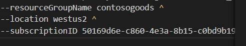
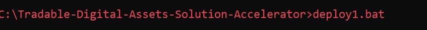

# Resource Deployment

This folder contains a PowerShell scripts that can be used to provision the Azure resources required to build your Blockchain solution.  You may skip this folder if you prefer to provision your Azure resources via the Azure Portal.  The PowerShell script will provision the following resources to your Azure subscription:

 
| Resource              | Usage                                                                                     |
|-----------------------|-------------------------------------------------------------------------------------------|
|[Azure Cosmos DB](https://azure.microsoft.com/en-us/services/cosmos-db/)  | The user information stored as a document    
|[Azure Cosmos DB](https://azure.microsoft.com/en-us/services/cosmos-db/)  | The catalog, gifts, assets information stored as a document         |
|[Azure Storage Account](https://azure.microsoft.com/en-us/services/storage/?v=18.24) | Data from Gifts and Assets|    
|[Key Vault ](https://azure.microsoft.com/en-us/services/key-vault/) | Store the Secret and Key to Encript Data and generate token for auth and communication   
|[Container Registry ](https://azure.microsoft.com/en-us/services/container-registry/) | Registry for the app in BlockChain  
|[BlockChain ](https://azure.microsoft.com/en-us/services/blockchain-service/)               | The Blockchain Network                                                    |
|[Kubernetes ](https://azure.microsoft.com/en-us/services/kubernetes-service/)               | K8s Service                                                    |

## Prerequisites
1. Access to an Azure Subscription
2. Azure CLI Installed

To deploy our resources we need execute the next steps.

1.- Open the file [deploy1.bat](../deploy1.bat) with a text editor and change the parameters if you wish. The unique parameter that you need change is the subscriptionId, this is the Id of your subscription of Azure that you have permission to create resources
This BAT file execute the ps1 File located in the **00_Resource_Deployment**.

2.- Open Command Prompt as **Administrator**.

3.- Go to folder to Locate File .BAT with CD command .

4.- In the Prompt run the the File .BAT and wait to 
finish.

5.- At the finish of execution of this file the prompt show **parameters** that you need configure in the **appsettings.json** of two Solution in Folder **01_Application_Deployment**.

5.- After you replace the values in the appsettings.json. Yo need go to the Folder  [**01_Application_Deployment**](../01_Application_Deployment) and follow the instructions.

6.- Only for your information this BAT File Executiong create the resources and create other files like ps script, yml to build image and configuration to push the image to container. Also crate files in storage and keys in key vault.

