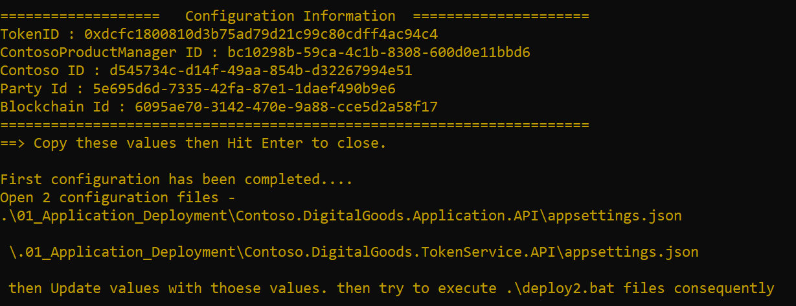
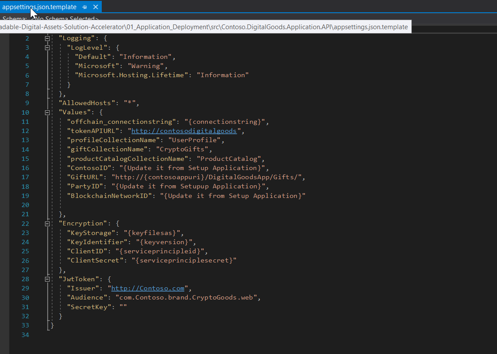
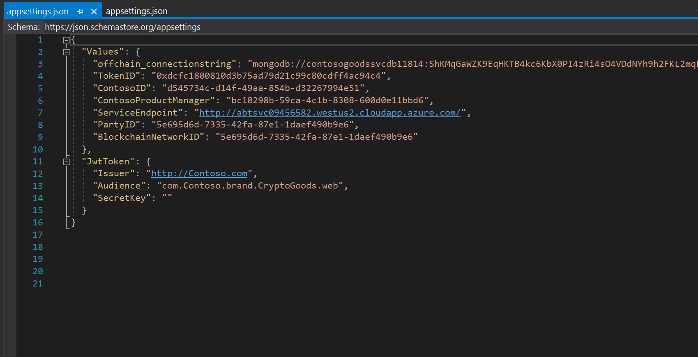
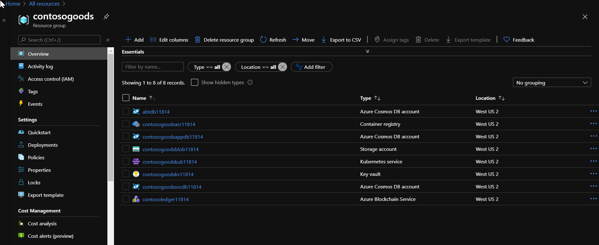

# Resource Deployment

This folder contains a PowerShell scripts that can be used to provision the Azure resources required to build your Blockchain solution.  You may skip this folder if you prefer to provision your Azure resources via the Azure Portal.  The PowerShell script will provision the following resources to your Azure subscription:

 
| Resource              | Usage                                                                                     |
|-----------------------|-------------------------------------------------------------------------------------------|
|[Azure Cosmos DB](https://azure.microsoft.com/en-us/services/cosmos-db/)  | The user information stored as a document    
|[Azure Cosmos DB](https://azure.microsoft.com/en-us/services/cosmos-db/)  | The catalog, gifts, assets information stored as a document         |
|[Azure Cosmos DB](https://azure.microsoft.com/en-us/services/cosmos-db/)  | Azure Cosmo DB for Microsoft Token Service         |
|[Azure Storage Account](https://azure.microsoft.com/en-us/services/storage/?v=18.24) | Data from Gifts and Assets|    
|[Key Vault ](https://azure.microsoft.com/en-us/services/key-vault/) | Store the Secret and Key to Encript Data and generate token for auth and communication   
|[Container Registry ](https://azure.microsoft.com/en-us/services/container-registry/) | Registry for the app in BlockChain  
|[BlockChain ](https://azure.microsoft.com/en-us/services/blockchain-service/)               | The Blockchain Network                                                    |
|[Kubernetes ](https://azure.microsoft.com/en-us/services/kubernetes-service/)               | K8s Service                                                    |

## Prerequisites
1. Access to an Azure Subscription
2. Azure CLI Installed

To deploy our resources we need execute the next steps.

1. Open the file [deploy1.bat](../deploy1.bat) with a text editor and change the parameters if you wish.  
   The unique parameter that you need change is the subscriptionId, this is the Id of your subscription of Azure that you have permission to create resources.  
[deploy1.bat](../deploy1.bat) file executes the [DeployResource1.ps1](DeployResources1.ps1) located in the **00_Resource_Deployment**.

                Powershell.exe -executionpolicy remotesigned -File .\00_Resource_Deployment\DeployResources1.ps1 ^
                            --resourceGroupName <<resourcegroup you want to build>> ^
                            --location westus2 ^
                            --subscriptionID <<your subscription ID>>

1. Open Command Prompt as **Administrator**.
2. Go to folder to Locate File .BAT with CD command
3. In the Prompt run the the File [deploy1.bat](../deploy1.bat) and wait to finish.

                \Tradable-Digital-Assets-Solution-Accelerator\deploy1.bat

4. At the finish of execution script, it shows **Configuration values** that you need to update in the **appsettings.json** of two Solution in Folders **01_Application_Deployment**.  
   Please keep these values carefully!

Open [AppSetting.json](../01_Application_Deployment/src/Contoso.DigitalGoods.Application.API/appsettings.json) for Application API and update placeholders with Configuration values.  
Update **ContosoID**, **PartyID** and **BlockchainNetworkID** placeholders with Configuration values. (another values in placeholders will be updated by script)

Open [AppSetting.json](../01_Application_Deployment/src/Contoso.DigitalGoods.TokenService.API/appsettings.json) for Token API and update placeholders with Configuration values.   
Update **ContosoID**, **TokenID**, **ContoProductManager**,**PartyID** and **BlockchainNetworkID** placeholders with Configuration values. (another values in placeholders will be updated by script)

Now you can check all of Azure resources deployed in your resource group successfully.  
Review the portal Azure and check that the resource group and 8 resources exists

and it's time to deploy source codes in Kubernetes cluster. Move to Next Step in [01_Application_Deployment/README.md](../01_Application_Deployment/README.md) file.
