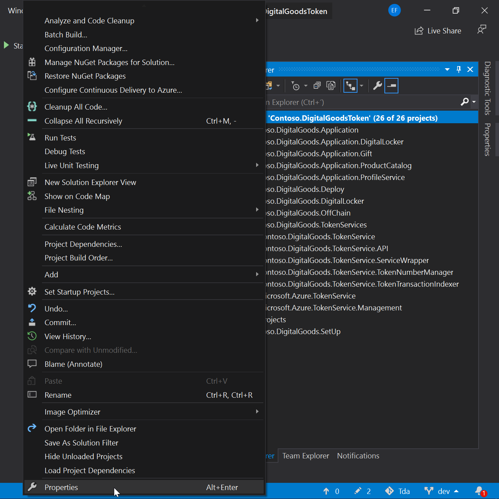
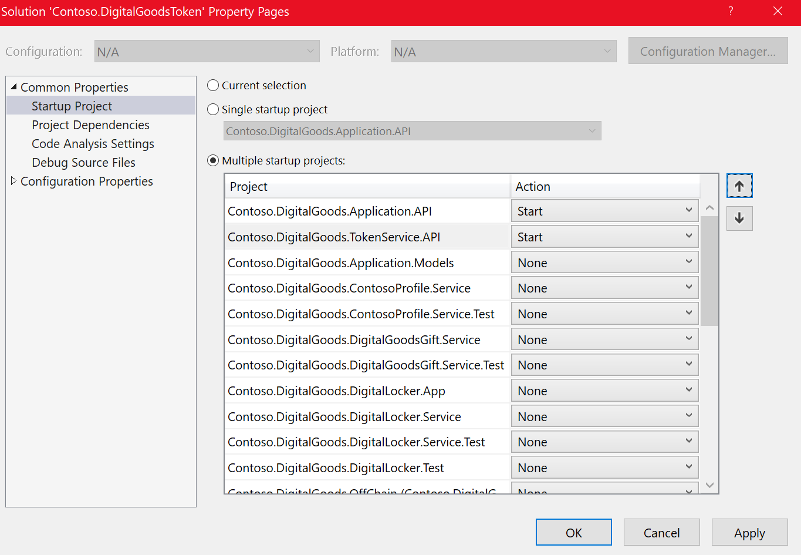
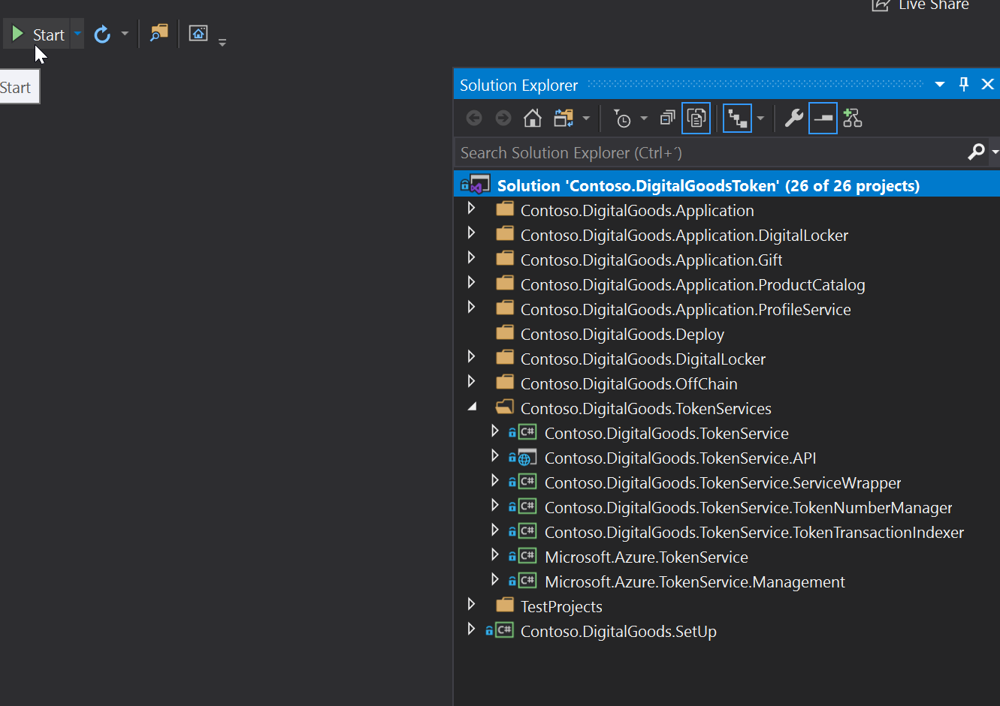
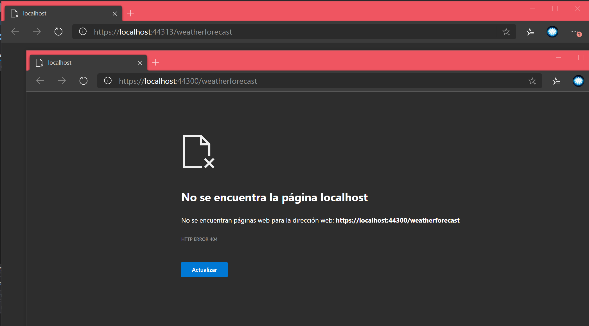
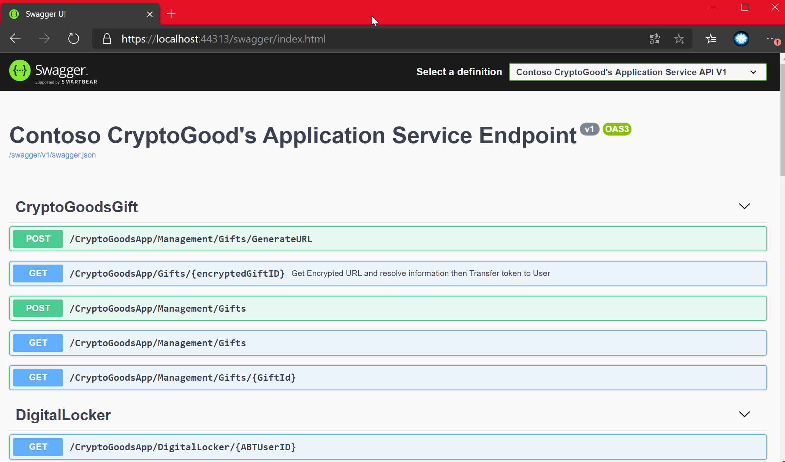
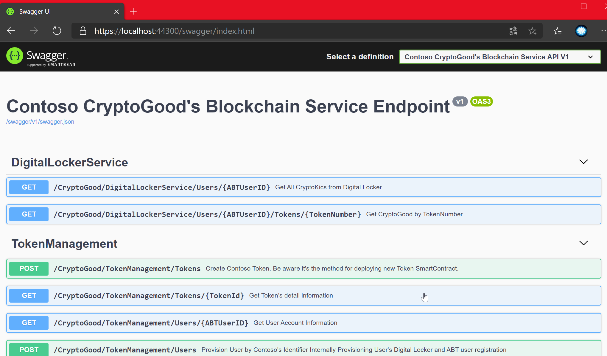
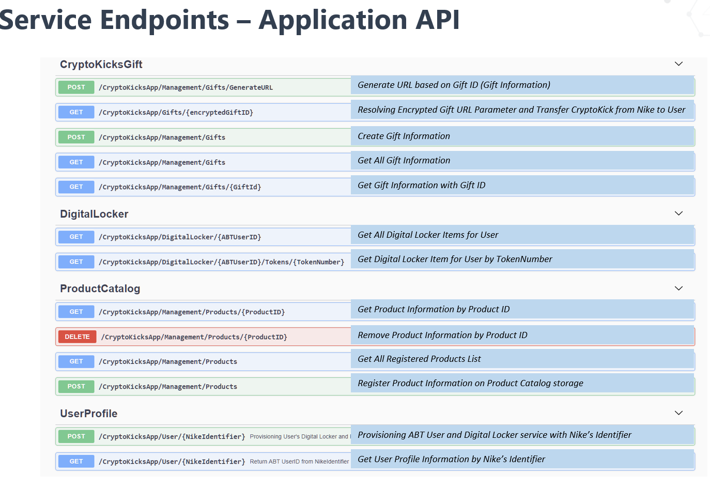
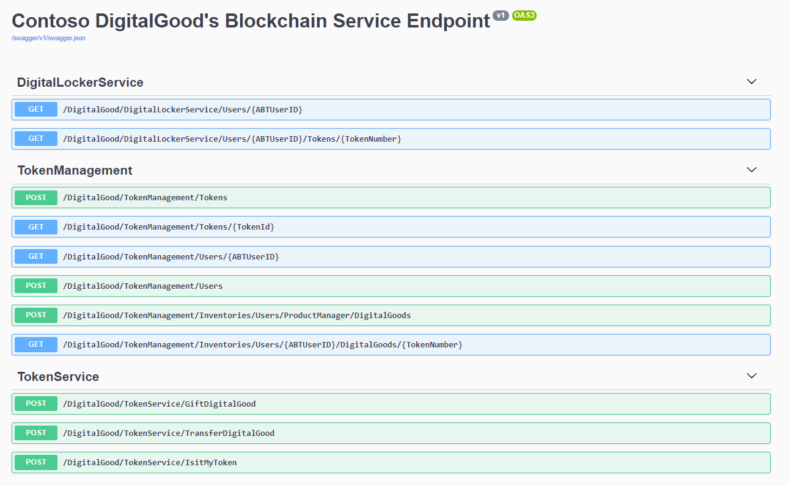

# Application Deployment

After following all previous steps, you will have a resource group containing a pair of CosmosDB, a Storage Account,kev Vault, BlockChain Servie, Container and a Kubernetes cluster. The Kubernetes cluster will be hosting a our solution.

## Prerequisites

1. Infrastructure deployed in the folder [00_Resource_Deployment](../00_Resource_Deployment) wiht the file bat

2. [Visual Studio](https://visualstudio.microsoft.com/)

3. [Docker Desktop](https://www.docker.com/products/docker-desktop/)

## How to Deploy your Solution

To deploy:

* Application Service
* BlockChain Service
* Microsoft Token Service 

Follow the next points.

1. The file deploy1.bat created the all resources that you need in Azure Subscription but also create other ps script to deploy the solution based in templates files. This files generated are Deployresources2.ps1, DeployApp.yml and deployTokenServices.yml and this are ready to be executed. This information is only informative to yout Knowledge, please follow the next steps. Other task that do the first Bat is modify the connection strings in the solution and put the correct values. 

2. Open Command Prompt as **Administrator**.

3. Go to folder to Locate File [deploy2.bat](../deploy2.bat) .BAT with CD command .

4. In the Prompt run the the File .BAT and wait to 
finish.

5. The execution of this file invokes the Api´s Deploy Building a image with Docker and Push the image to the Container Registry in Azure and Configure in K8s service.

## How to Run Locally you Solution

**1.- Local with visual Studio**

# Steps
1. Open [Contoso.DigitalGoodsToken.sln](./src/Contoso.DigitalGoodsToken.sln) in Visual Studio (as Admin)
2. Build Project
3. Run the **Contoso.DigitalGoods.Application.API** project or **Microsoft.Azure.TokenService** project to activate the different endpoints. In other case yo can configure the execution for both projects.

In the Next images we have the specif steps to execute the solution:

* Go to Properties of Solution.

* Select Multiple Starup and Select the projects Contoso.DigitalGood.Application.API and Contoso.Digital.TokenService.API.

* Run

* You can see two Browsers with a message 404. Yo need Modify and delete the word "weatherforecast" and replace by "swagger"

* You can see the operations avalilable and test with the scripts or consume in other way

* You need configure the connections strings, secrets and configure JWT information for each project in the appsetting.json.

## Components
This project contains a number of components described below.

| Resource              | Usage                                                                                     |
|-----------------------|-------------------------------------------------------------------------------------------|
| Application Api  | Provide the Actions in the endpoint to manage users, catalogs and gifts        |
| Blockchain Api  |Provide actions to manage Digital Locker, Token Managment and Communicate with Token Service|                                                     |

 # Using the Application  

 
 

  # _Application Api_ Endpoints

To use the services of this application we attach some [scripts](./Scripts.zip) of sample to execute that operation in Postman. Each operation is specified in the next images.

  

  # Blockchain Service Api

  
