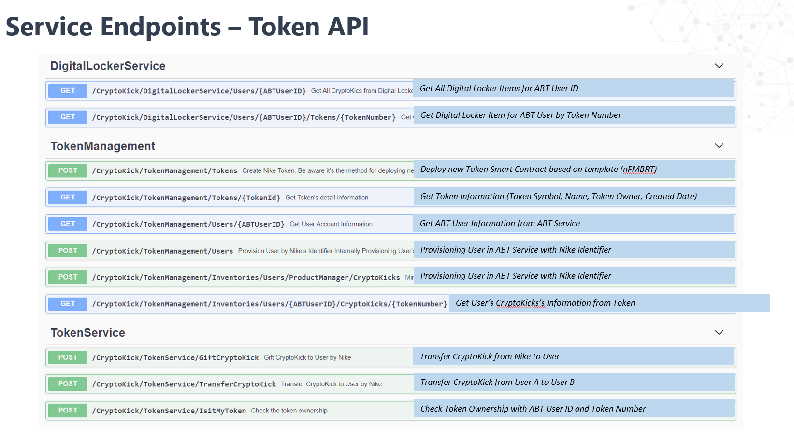

# Application Deployment
After following all previous steps, you will have a resource group containing a pair of CosmosDB, a Storage Account,kev Vault, BlockChain Servie, Container and a Kubernetes cluster. The Kubernetes cluster will be hosting a our solution.

There are a few modifications to the [Contoso.DigitalGoodsToken.sln](./src/./src/Contoso.DigitalGoodsToken.sln) that need to be made to work with your infrastructure. The connection strings of Cosmos DB and Key Vaults.

<!-- To update the necessary appsettings.json connection strings, run the deploy.ps1 script. -->

## Prerequisites
1. Infrastructure deployed in the folder [00_Resource_Deployment](../00_Resource_Deployment)
2. [Visual Studio](https://visualstudio.microsoft.com/)
3. Updated connection strings

## Options
You can either run the application locally or hosted using Kubernates in your resource group. In the project **Contoso.DigitalGoods.Application.API** have a DockerFile to build the image.

# Steps
1. Open [Contoso.DigitalGoodsToken.sln](./src/Contoso.DigitalGoodsToken.sln) in Visual Studio (as Admin)
2. Build Project
3. Run the **Contoso.DigitalGoods.Application.API** project or **Microsoft.Azure.TokenService** project to activate the different endpoints. In other case yo can configure the execution for both projects.

## Components
This project contains a number of components described below.

| Resource              | Usage                                                                                     |
|-----------------------|-------------------------------------------------------------------------------------------|
| Application Api  | Provide the Actions in the endpoint to manage users, catalogs and gifts        |
| Token Api  | Manage the generation of Tokens for different actions for the application|                                                     |

 # Using the Application

 To use the services of this application we attach some [scripts](./Scripts.zip) script of sample to execute that operation in Postman. Each operation is specified in the next images.
 

  # _Application Api_ Endpoints

  

  # _Token Api_ Endpoints

  
 