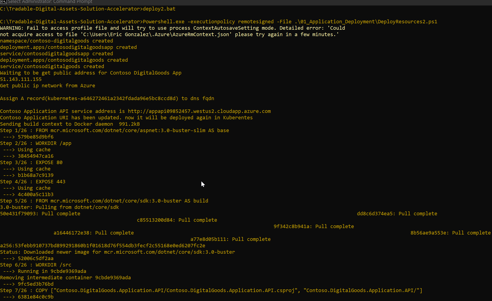
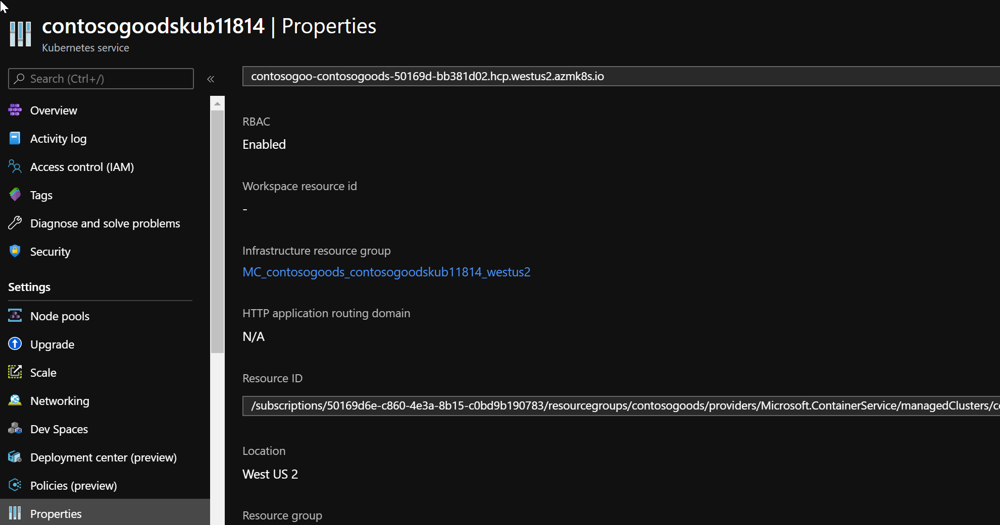
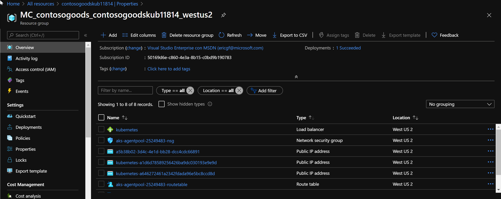
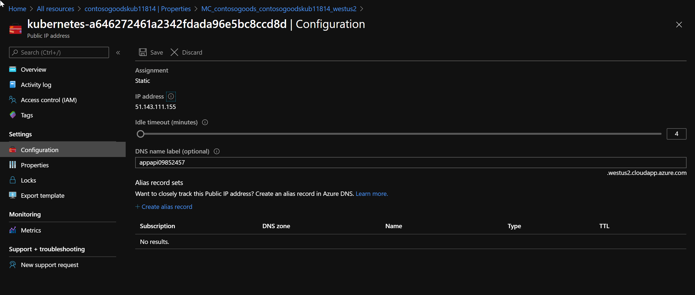
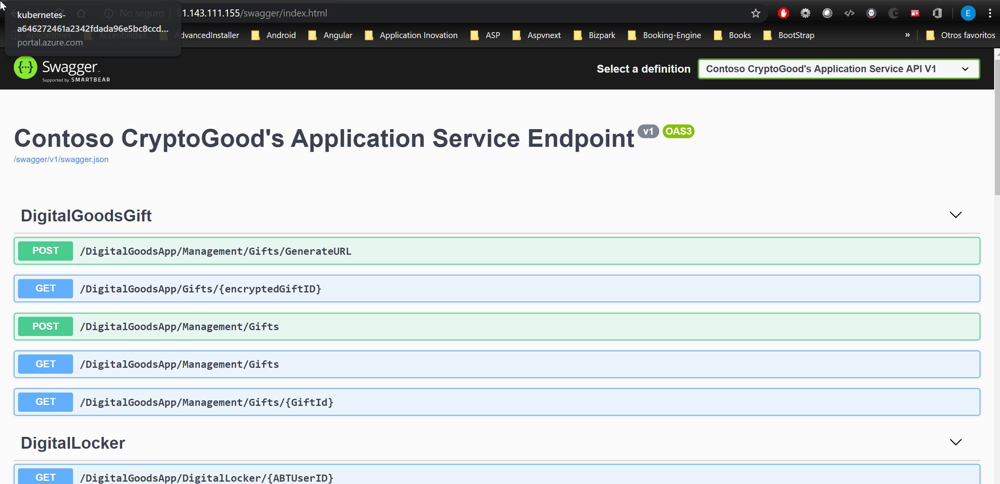

# Application Deployment

After following all previous steps, you will have a resource group containing a pair of CosmosDB, a Storage Account,kev Vault, BlockChain Servie, Container and a Kubernetes cluster. The Kubernetes cluster will be hosting a our solution.

## Prerequisites

1. Infrastructure deployed in the folder [00_Resource_Deployment](../00_Resource_Deployment) wiht the file bat

2. [Visual Studio](https://visualstudio.microsoft.com/)

3. [Docker Desktop](https://www.docker.com/products/docker-desktop/)

## How to Deploy your Solution

To deploy:

* Application Service
* BlockChain Service
* Microsoft Token Service 

Follow the next points.

1. The file [deploy1.bat](../deploy1.bat) invokes [deployResources1.ps1](../00_Resource_Deployment/DeployResources1.ps1) which created all Azure resources that you need in Azure Subscription also generated powershell script [deployResources2.ps1](./DeployResources2.ps1) to deploy source codes with dynamic values.  
   The generated files by deployResource1.ps1 are [deployResources2.ps1](./DeployResources2.ps1), DeployApp.yml and deployTokenServices.yml and this are ready to be executed.  
   This Information is only informative to your Knowledge, please follow the next steps. Other task that do the first Bat is modify the connection strings in the solution and put the correct values.  

2. Open Command Prompt as **Administrator**.

3. Go to folder to Locate File [deploy2.bat](../deploy2.bat) .BAT with CD command .

4. In the Prompt run the the File .BAT and wait to finish.
   
       \Tradable-Digital-Assets-Solution-Accelerator\deploy2 .bat

You can see the source codes are containerized and push Container registry then deploy in Kubernetes cluster.

## How to Verify The Deploy

  After the execution of [deploy1.bat](../deploy1.bat) and [deploy2.bat](../deploy2.bat), we may check all of resources has been created and applications are deployed in Kubernetes correctly.  
  It's time to verify the apis with following steps.

* Go to resources in azure portal and select the kubernetes Service

* Go to  Propierties and Select The Infrastructure resource group

* Inside this you can check 3 Public IP addresses

* Select Each and go to Configuration and Copy the IP Address. (or you may use DNS name per each Public IP address)

* Check the each Service endpoints with this url - [http://Public_IP_Addresss/swagger](http://Public_IP_Addresss/swagger) in your browser.

* You can check Application API, Token Service API and Microsoft Token Service API endpoints with each IPs with this way.

## How to Run Locally you Solution

# Steps
1. Open [Contoso.DigitalGoodsToken.sln](./src/Contoso.DigitalGoodsToken.sln) in Visual Studio (as Admin)
2. Build Project
3. Run the **Contoso.DigitalGoods.Application.API** project or **Microsoft.Azure.TokenService** project to activate the different endpoints. In other case yo can configure the execution for both projects.

In the Next images we have the specif steps to execute the solution:

* Go to Properties of Solution.

* Select Multiple Starup and Select the projects Contoso.DigitalGood.Application.API and Contoso.Digital.TokenService.API.

* Run

* You can see two Browsers with a message 404. Yo need Modify and delete the word "weatherforecast" and replace by "swagger"

* You can see the operations avalilable and test with the scripts or consume in other way

* You need configure the connections strings, secrets and configure JWT information for each project in the appsetting.json.

## Components

This project contains a number of components described below.

| Resource              | Usage                                                                                     |
|-----------------------|-------------------------------------------------------------------------------------------|
| Application Api  | Provide the Actions in the endpoint to manage users, catalogs and gifts        |
| Blockchain Api  |Provide actions to manage Digital Locker, Token Managment and Communicate with Token Service|                                                     |

 # Using the Application  

 
 

  # _Application Api_ Endpoints

To use the services of this application we attach some [scripts](./Scripts.zip) of sample to execute that operation in Postman. Each operation is specified in the next images.

  

  # Blockchain Service Api

  
