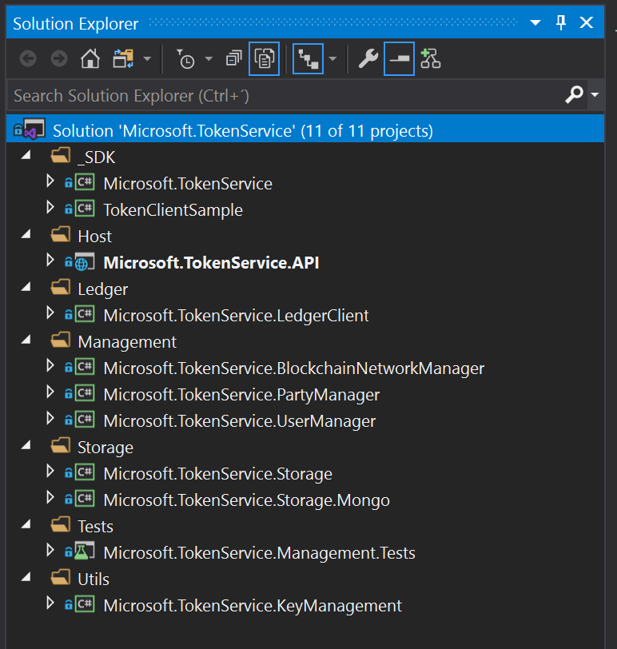
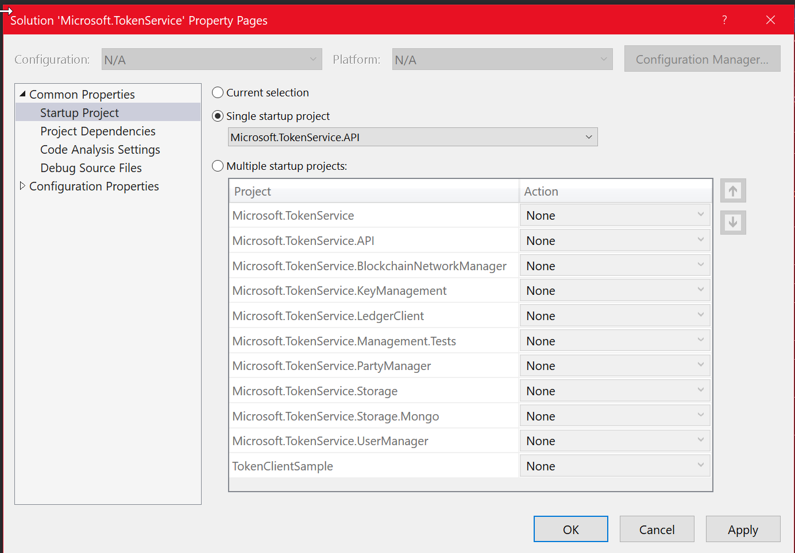
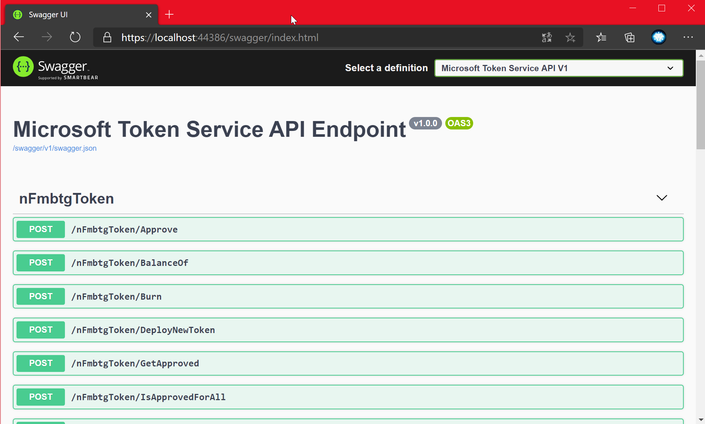
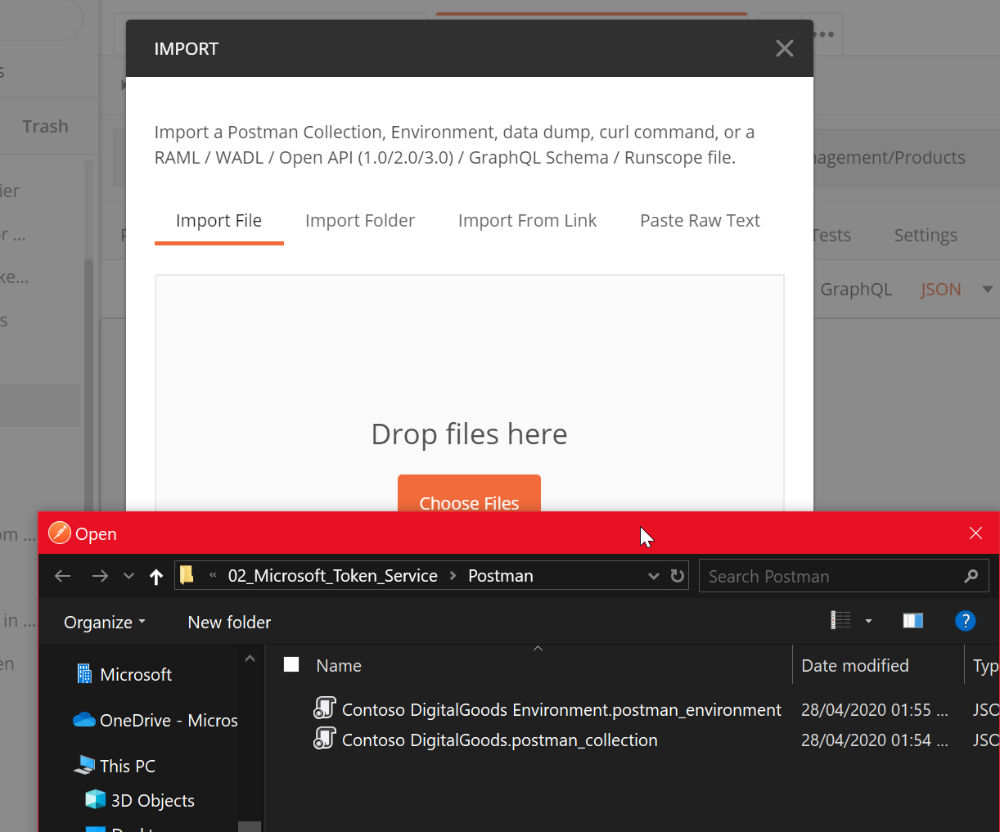
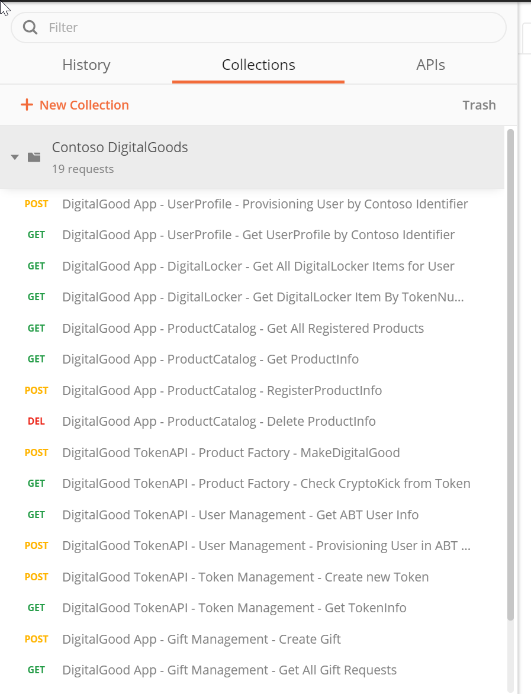
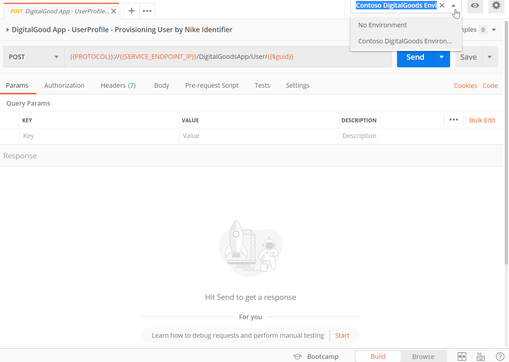

# Application Deployment

After review the previous sections. You have a deployed resources in azure and deploy is done for all the Api services. This sections is to Know more about Microsoft Token Services.

## Prerequisites
1. [Postman](https://www.postman.com/)
2. Visual Studio

## How to run local the solution

* Open the Solution [MIcrosoft.TokenService.sln]()

* Go to propierties of Solution

 
* Select single start up for Microsoft.TokenService.API project

 

* In the webbrowser that Visual Studio Launch go to https://localhost:44386/swagger/index.html

* You can view the actions and consume with the scripts.

Note: To Run the solution in Local Enviroment you need update the URL in ContosoSolution with the Microsoft Token Services Solution.

## How to consume the endpoint

Before to consume our [endpoint](http://51.143.111.232/swagger/index.html) we can review the actions.

# Token Actions

  

  # Managment Actions 

   

Now when we see the actions we can test and consume the endpoint with the next step help us with Postman.

1. Open Postman
2. Go to the button Import and select the files from [scripts](./Postman.zip).

***Enviroment File**

_Contoso DigitalGoods Environment.postman_environment.json_.

***Collection File**

 _Contoso DigitalGoods Environment.postman_collection.json_.

  
3. Select Collections and select our collection
  
4. Select one operation and enviroment correctly
  
5. Press Send button and view the result.

Note: You can configure the enviroment variables to changue the url and more parameters.