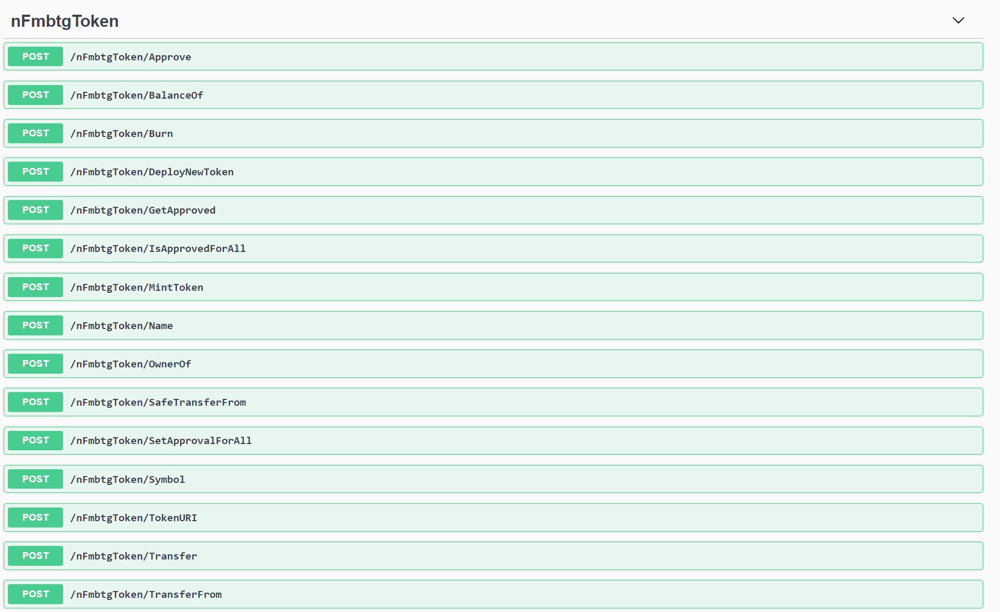
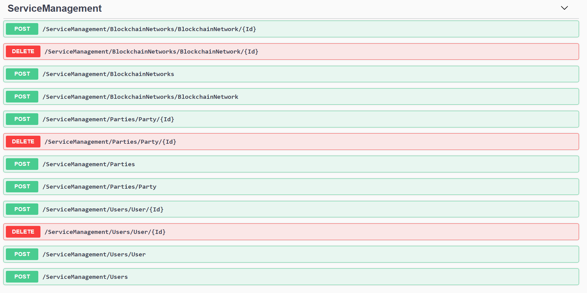

# Application Deployment

After review the previous sections. You have a deployed resources in azure, a source code that now you know how to deploy and run in Visual Studio/Azure and Docker. You have how to access to the endpoints of Solution (Application and Blockchain Actions).

Now in this part you can learn and discover the endpoint of Microsoft Token Service that provide to Blockchain actions the logic to manage Tokens (Aprove, Deploy and Propierties), Service Managment (BlockChain Network, Parties, Users)

## Prerequisites
1. [Postman](https://www.postman.com/)
2. Updated scripts

## How to Consume the endpoint?

Before to consume our [endpoint](http://52.137.97.182/swagger/index.html) we can review the actions.

# Token Actions

  

  # Managment Actions 

   

Now when we see the actions we can test and consume the endpoint with the next step help us with Postman.

1.- Open Postman
2.- Go to the button Import and select the files .json
()