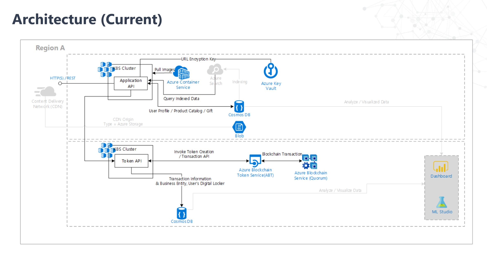

# Tradable Digital Assets Solution Accelerator

## About this repository

This accelerator was built to provide developers with all of the resources needed to quickly build an Tradable Digital Assets Solution.  
it contains whole things when we think about building Tokenized Digital Asset trading system. you can check from how to build ERC token standard Blockchain smart contract based API development to Blockchain transaction singing, key management and managing user's Digital wallets.

This repository contains the Azure resource deployment scripts, source codes and references and tools.
The Azure resource deployment script is in [00_Resource_Deployment](00_Resource_Deployment/README.md).  
It deploys Azure Blockchain Service, Azure Kubernetes Service, Azure Container Registry, Azure KeyVault, Azure Storage Account, Azure CosmosDB.   

[01_Application_Deployment](01_Application_Deployment/README.md) has Application source codes which shows how to interact user's key and transaction singing and transactions and  
[02_Microsoft_Token_Service](02_Microsoft_Token_Service/README.md) has ERC 721 standard token service API service codes. this service has been designed to be reused  independently in any digital Tokenized business cases.

It will help to start building Blockchain based Application quickly or understanding how to start building Tokenized Application from the scratch.

## Prerequisites

In order to complete deployment the solution successfully, you need to prepare the following:

1. Access to an Azure subscription
2. Visual Studio 2017 or 2019
3. PowerShell 7.x
4. Azure cli
5. Postman
6. Docker Desktop  

Optional

1. Visual Studio Code

## Azure and Blockchain

We assume you have already fundamental technical understandings and knowledge of Azure Blockchain Service, Azure Cosmos DB, Azure Storage Account, Key Vault, Azure Kubernetes Services and Blockchain([Ethereum](http://www.ethereum.org), [Quorum](https://www.goquorum.com/)).  

For additional training and support, please see:

 1. [Kubernetes](https://kubernetes.io/)
 2. [Blockchain](https://azure.microsoft.com/en-us/solutions/blockchain/)
 3. [KeyVault](https://docs.microsoft.com/en-us/azure/key-vault/basic-concepts)
 4. [Cosmos DB](https://docs.microsoft.com/en-us/azure/cosmos-db/introduction)

## Getting Started and Process Overview

Clone/download this repo onto your computer and then walk through each of these folders in order, following the steps outlined in each of the README files.  After completion of all steps, you will have a working solution with the following architecture:

### [00 - Resource Deployment](./00_Resource_Deployment)

The resources in this folder can be used to deploy the required resources into your Azure Subscription.  
This can be done executing [deploy1.bat](./deploy1.bat) file invokes [powershell script](00_Resource_Deployment/README.md) with parameters that creates and config Azure resources.

After executing this script, you can get whole Azure resources(Azure Kubernetes Service, Azure Container Registry, Azure Blockchain Service, Azure Storage Account, Azure KeyVault and Azure Cosmos DB).

### [01- Application Deployment](./01_Application_Deployment)

This folder contains the Application source codes that contains the API services that provide the functionality to User provisioning (Blockchain account, private keys and digital wallet), managing digital assets (Catalog and Products and Gifts Management).

Also it contains the [script templates](./01_Application_Deployment/DeployResource2.ps1.template) that used to deploy the source codes to Kubernetes cluster. it will be invoked by another batch file [deploy2.bat](./deploy2.bat)

### [02- Microsoft Token Service](./02_Microsoft_Token_Service)

This folder contains the ERC 721 Token Standard API services and User and Blockchain consortium party management service APIs.  
You can leverage this service independently with another business use cases.

## Links

You can check running Demo from these API endpoints.  

* [Application Service Endpoint](http://51.143.61.82/swagger/index.html), you can use scripts to consume the endpoints.

* [BlockChain Service Api Endpoint](http://40.91.124.177/swagger/index.html), you can use scripts to consume the endpoints.

* [Microsoft Token Service API Endpoint](http://40.91.80.182/swagger/index.html), you can use scripts to consume the endpoints.

## License

Copyright (c) Microsoft Corporation

All rights reserved.

MIT License

Permission is hereby granted, free of charge, to any person obtaining a copy of this software and associated documentation files (the ""Software""), to deal in the Software without restriction, including without limitation the rights to use, copy, modify, merge, publish, distribute, sublicense, and/or sell copies of the Software, and to permit persons to whom the Software is furnished to do so, subject to the following conditions:

The above copyright notice and this permission notice shall be included in all copies or substantial portions of the Software.

THE SOFTWARE IS PROVIDED AS IS, WITHOUT WARRANTY OF ANY KIND, EXPRESS OR IMPLIED, INCLUDING BUT NOT LIMITED TO THE WARRANTIES OF MERCHANTABILITY, FITNESS FOR A PARTICULAR PURPOSE AND NONINFRINGEMENT. IN NO EVENT SHALL THE AUTHORS OR COPYRIGHT HOLDERS BE LIABLE FOR ANY CLAIM, DAMAGES OR OTHER LIABILITY, WHETHER IN AN ACTION OF CONTRACT, TORT OR OTHERWISE, ARISING FROM, OUT OF OR IN CONNECTION WITH THE SOFTWARE OR THE USE OR OTHER DEALINGS IN THE SOFTWARE

## Contributing

This project welcomes contributions and suggestions.  Most contributions require you to agree to a
Contributor License Agreement (CLA) declaring that you have the right to, and actually do, grant us
the rights to use your contribution. For details, visit https://cla.microsoft.com.

When you submit a pull request, a CLA-bot will automatically determine whether you need to provide
a CLA and decorate the PR appropriately (e.g., label, comment). Simply follow