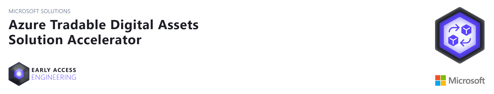
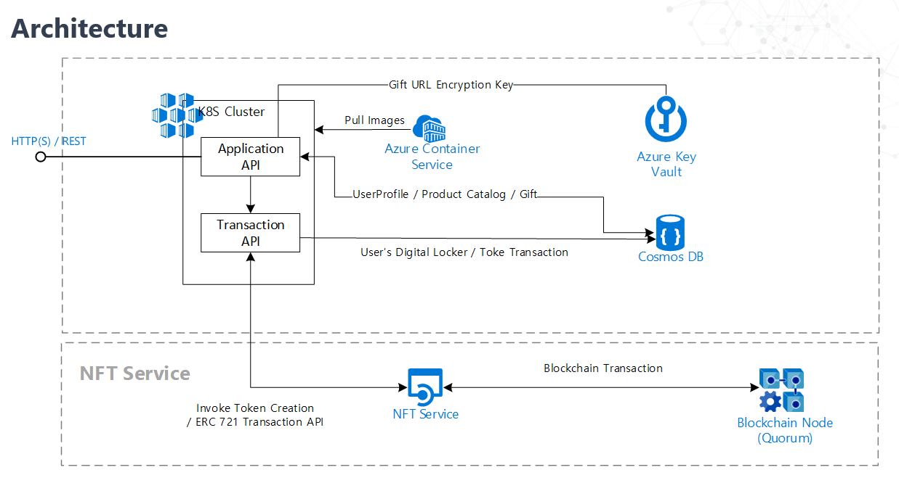

## About This Repository

This accelerator was designed to provide developers with all of the resources needed to quickly build a solution for trading digital assets, using Azure services.
It contains instructions on how to configure and deploy the essential components of a trading system for tokenized digital assets, including: API based creation of smart contracts using ERC token standards,
 blockchain transaction signing, key management, and integrating with digital wallets. 

This repository contains source code, deployment scripts, along with references and tools, to quickly get you up and running with your own solution for trading digital assets.
It will speed your understanding of blockchain-based applications and help you build other applications leveraging blockchain tokens. 

## Prerequisites

In order to successfully deploy this solution accelerator, you will need to have access to and/or provision the following resources:

1. [Access to an Azure Subscription](http://portal.azure.com), with required permissions - Required to deploy cloud resources
2. [Visual Studio 2019 or newer version](https://visualstudio.microsoft.com/downloads/)
3. [PowerShell 7.x](https://docs.microsoft.com/en-us/powershell/scripting/install/installing-powershell?view=powershell-7.1) - Required to run deployment scripts
4. [Azure CLI](https://docs.microsoft.com/en-us/cli/azure/install-azure-cli) - Required to run deployment scripts
5. [Postman](https://www.postman.com/)
6. [Docker Desktop](https://hub.docker.com/editions/community/docker-ce-desktop-windows) - Required for debugging on your local machine or containerizing codes in the Deployment process 

Optional

1. [Visual Studio Code](https://code.visualstudio.com/)


## Architectural Overview

 After completion of all steps, you will have a working solution with the architecture shown below. 



## Azure and Blockchain

We assume you have basic technical knowledge of Azure Cosmos DB, Azure Storage Account, Azure Key Vault, and Azure Kubernetes Services,
and are familiar with blockchain platforms such as ([Ethereum](http://www.ethereum.org) and [Quorum](https://www.goquorum.com/)).  


This SA leverages [Azure Non-Fungible Token Solution Accelerator](https://github.com/microsoft/Azure-Non-Fungible-Token-Solution-Accelerator) for managing NFT transactions.
Please review  Azure Non-Fungible Token Solution Accelerator before you begin this project.


For additional training and support, please see:

 1. [Kubernetes](https://kubernetes.io/)
 1. [Cosmos DB](https://docs.microsoft.com/en-us/azure/cosmos-db/introduction)
 1. [Blockchain](https://azure.microsoft.com/en-us/solutions/blockchain/)
 1. [KeyVault](https://docs.microsoft.com/en-us/azure/key-vault/basic-concepts)
  
## Getting Started

This solution accelerator relies on the capabilities developed in the [Azure Non-Fungible Token Solution Accelerator](https://github.com/microsoft/Azure-Non-Fungible-Token-Solution-Accelerator).

That accelerator is designed to help manage ERC 721 standard token transactions and can be applied to most any business scenario that can benefit from blockchain technology. Please review the NFT token service accelerator before continuing this project.


Clone/download this repo onto your computer and then walk through each of these steps in order, following the steps outlined in each of the README files.

### [01. Azure Resource Deployment](./deployment/Resource_Deployment/README.md):
The resources in this folder can be used to deploy the required cloud services into your Azure Subscription. This can be done either via the [Azure Portal](https://portal.azure.com) or by using the [PowerShell script](./deployment/Resource_Deployment/ARMTemplates/Bicep/resourcedeployment.ps1) included in the deployment folder.

After resource deployment is complete, you will have these services available: Azure Container Registry, Azure Cosmos DB, Azure Key Vault, Azure Kubernetes Service, and Azure Storage.

Resources can also be deployed into your Azure Subscription by using one of these Deploy Azure links:  

[](https://portal.azure.com/#create/Microsoft.Template/uri/https%3A%2F%2Fraw.githubusercontent.com%2Fmicrosoft%2FTradable-Digital-Assets-Solution-Accelerator%2Fmaster%2Fdeployment%2FResource_Deployment%2FARMTemplates%2FJson%2Fmain.json)&emsp;&emsp;&emsp;
[](https://portal.azure.us/#create/Microsoft.Template/uri/https%3A%2F%2Fraw.githubusercontent.com%2Fmicrosoft%2FTradable-Digital-Assets-Solution-Accelerator%2Fmaster%2Fdeployment%2FResource_Deployment%2FARMTemplates%2FJson%2Fmain.json)&emsp;&emsp;&emsp;

**Note: Follow all steps from "Step 3" in [Resources Deployment](./deployment/Resource_Deployment/README.md#Step-3-Configure-Managed-Identity) to configure managed identity permissions, if you have deployed resources using one of these Azure links.**

### [02. Application Deployments](./deployment/Application_Deployment/README.md):
Deploy [applications](./deployment/Application_Deployment/README.md) using a [PowerShell script](./deployment/Application_Deployment/deployApplication.ps1) that will deploy source code from the repo to Azure resources.   

### [03. Solution Testing](./documents/README.md):
This [Windows Client Application](./documents/README.md) can be used to test and demonstrate the solution. Additionally, you can use this [documentation](./documents/Postman.md) for testing APIs using Postman. 


## Folders

Refer to the following folders to learn about the solution components specific to **Azure Tradable Digital Assets Solution Accelerators**. 
- [deployment](./deployment): Contains ARM template, resource deployment script, application deployment script, and documentation to facilitate deployment of Azure resources and applications. 
- [documents](./documents): Contains client app and postman documentation, and screenshots for this solution accelerator. 
- [src](./src): Contains all source code for this solution accelerator  


## Microsoft Open Source Code of Conduct

This project has adopted the [Microsoft Open Source Code of Conduct](https://opensource.microsoft.com/codeofconduct/).

Resources:
- [Microsoft Open Source Code of Conduct](https://opensource.microsoft.com/codeofconduct/)
- [Microsoft Code of Conduct FAQ](https://opensource.microsoft.com/codeofconduct/faq/)
- Contact [opencode@microsoft.com](mailto:opencode@microsoft.com) with questions or concerns


## License

Copyright (c) Microsoft Corporation

All rights reserved.

MIT License

Permission is hereby granted, free of charge, to any person obtaining a copy of this software and associated documentation files (the ""Software""), to deal in the Software without restriction, including without limitation the rights to use, copy, modify, merge, publish, distribute, sublicense, and/or sell copies of the Software, and to permit persons to whom the Software is furnished to do so, subject to the following conditions:

The above copyright notice and this permission notice shall be included in all copies or substantial portions of the Software.

THE SOFTWARE IS PROVIDED AS IS, WITHOUT WARRANTY OF ANY KIND, EXPRESS OR IMPLIED, INCLUDING BUT NOT LIMITED TO THE WARRANTIES OF MERCHANTABILITY, FITNESS FOR A PARTICULAR PURPOSE AND NONINFRINGEMENT. IN NO EVENT SHALL THE AUTHORS OR COPYRIGHT HOLDERS BE LIABLE FOR ANY CLAIM, DAMAGES OR OTHER LIABILITY, WHETHER IN AN ACTION OF CONTRACT, TORT OR OTHERWISE, ARISING FROM, OUT OF OR IN CONNECTION WITH THE SOFTWARE OR THE USE OR OTHER DEALINGS IN THE SOFTWARE


## Security

Microsoft takes the security of our software products and services seriously, which includes all source code repositories managed through our GitHub organizations, which include [Microsoft](https://github.com/Microsoft), [Azure](https://github.com/Azure), [DotNet](https://github.com/dotnet), [AspNet](https://github.com/aspnet), [Xamarin](https://github.com/xamarin), and [our GitHub organizations](https://opensource.microsoft.com/).

If you believe you have found a security vulnerability in any Microsoft-owned repository
 that meets Microsoft's [Microsoft's definition of a security vulnerability](https://docs.microsoft.com/en-us/previous-versions/tn-archive/cc751383(v=technet.10)), 
 please report it to us as described here: [Reporting Security Issues](./SECURITY.md)

**Please do not report security vulnerabilities through public GitHub issues or any other public forum.**

## Privacy

When you deploy this template, Microsoft is able to identify the installation of the software with the Azure resources that are deployed. Microsoft is able to correlate the Azure resources that are used to support the software. Microsoft collects this information to provide the best experiences with their products and to operate their business. The data is collected and governed by Microsoft's privacy policies, which can be found at [Microsoft Privacy Statement](https://go.microsoft.com/fwlink/?LinkID=824704).

To disable this, simply remove the following section from [main.json](/deployment/Resource_Deployment/ARMTemplates/Json/main.json) before deploying the resources to Azure:

```json
{
    "type": "Microsoft.Resources/deployments",
    "apiVersion": "2021-04-01",
    "name": "pid-061ff772-6c53-588a-8308-3c4e26553581",
    "properties": {
    "mode": "Incremental",
    "template": {
        "$schema": "https://schema.management.azure.com/schemas/2019-04-01/deploymentTemplate.json#",
        "contentVersion": "1.0.0.0",
        "resources": []
    }
    }
}
```

You can see more information on this at https://docs.microsoft.com/en-us/azure/marketplace/azure-partner-customer-usage-attribution.

## Contributing

This project welcomes contributions and suggestions.  Most contributions require you to agree to a
Contributor License Agreement (CLA) declaring that you have the right to, and actually do, grant us
the rights to use your contribution. For details, visit https://cla.microsoft.com.

When you submit a pull request, a CLA bot will automatically determine whether you need to provide a CLA and decorate the PR appropriately (e.g., status check, comment). 
Simply follow the instructions provided by the bot. You will only need to do this once across all repos using our CLA.


## Support

### How to file issues and get help  

This project uses GitHub Issues to track bugs and feature requests. Please search the existing 
issues before filing new issues to avoid duplicates.  For new issues, file your bug or 
feature request as a new Issue.


### Microsoft Support Policy  

Support for this project is limited to the resources listed above.


## Trademarks

This project may contain trademarks or logos for projects, products, or services. Authorized use of Microsoft 
trademarks or logos is subject to and must follow 
[Microsoft's Trademark & Brand Guidelines](https://www.microsoft.com/en-us/legal/intellectualproperty/trademarks/usage/general).
Use of Microsoft trademarks or logos in modified versions of this project must not cause confusion or imply Microsoft sponsorship.
Any use of third-party trademarks or logos are subject to those third-party's policies.


## Notices

Do Not Translate or Localize

This software incorporates material from third parties.
Microsoft makes certain open source code available at https://3rdpartysource.microsoft.com,
or you may send a check or money order for US $5.00, including the product name,
the open source component name, platform, and version number, to:

Source Code Compliance Team  
Microsoft Corporation  
One Microsoft Way  
Redmond, WA 98052  
USA  

Notwithstanding any other terms, you may reverse engineer this software to the extent
required to debug changes to any libraries licensed under the GNU Lesser General Public License.