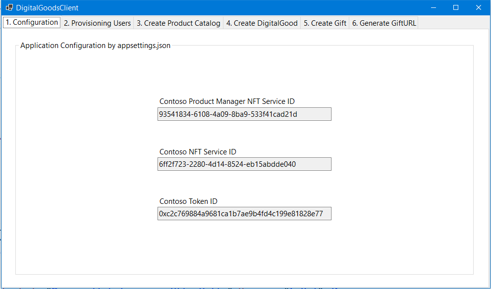
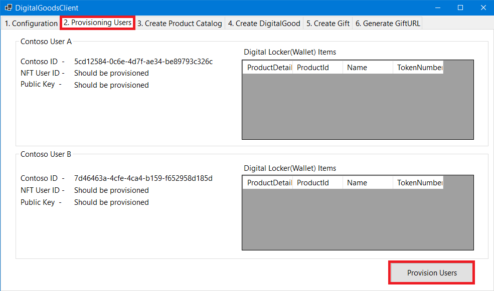
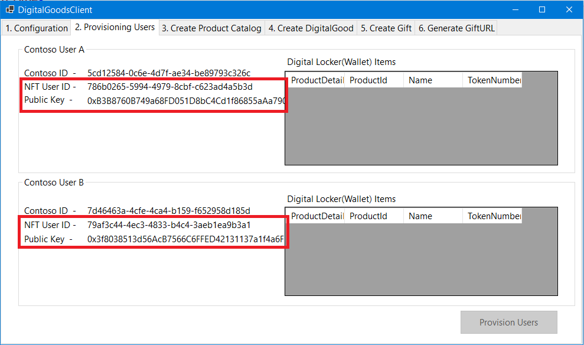
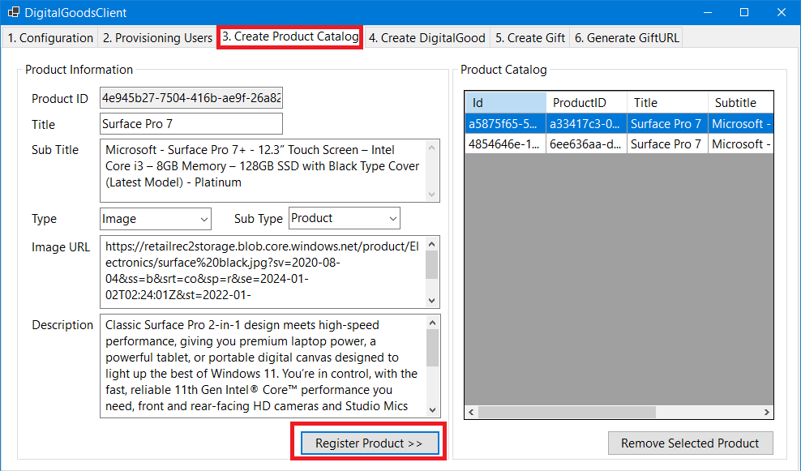
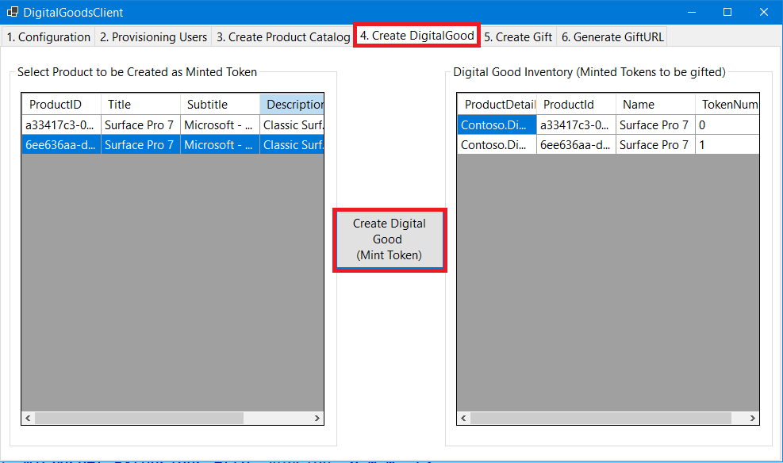
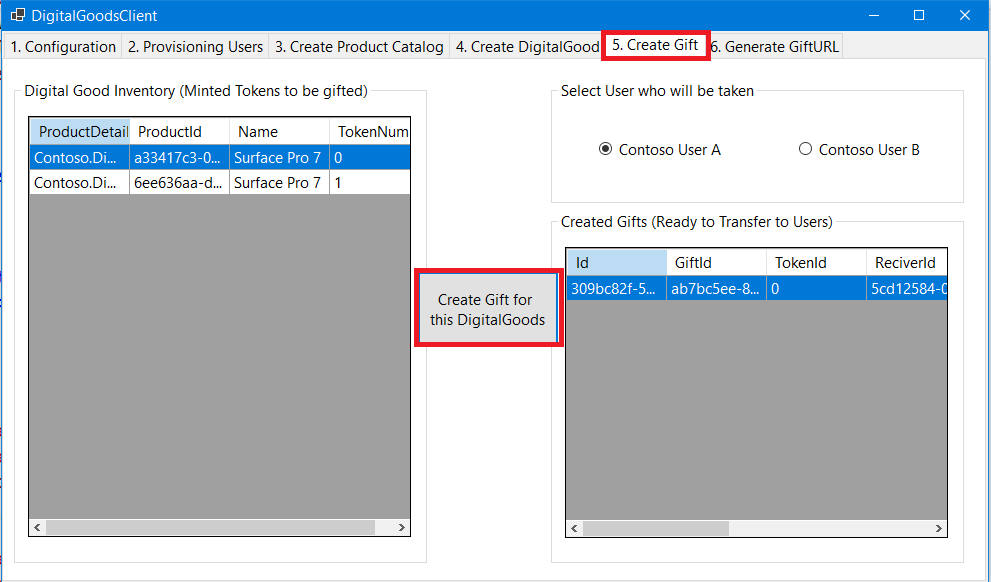
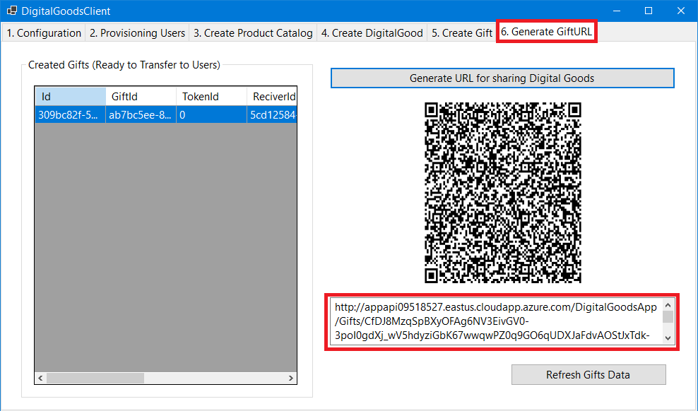
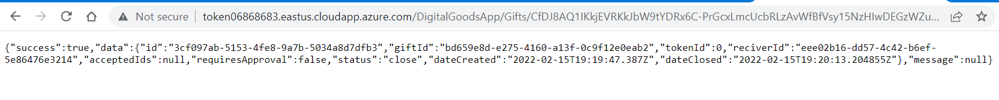
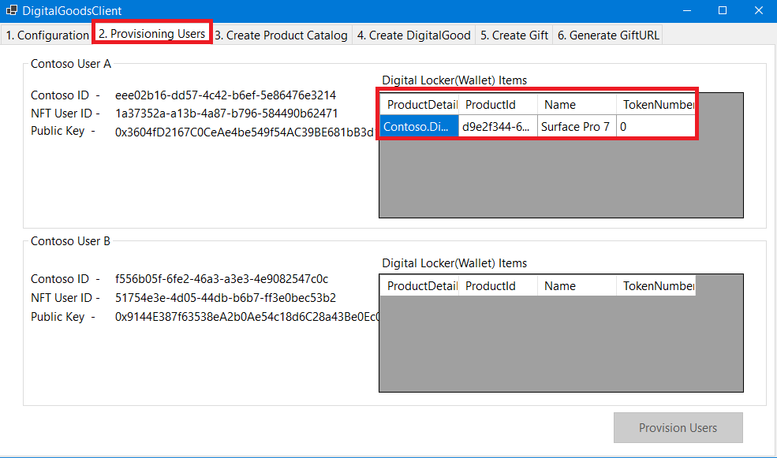

# Windows Client Application

This documentation contains information on how to run the sample Windows Client application to demonstrate the **Azure Tradable Digital Assets Solution Accelerator**.

 
## Prerequisites
1. Access to an Azure subscription
1. Fundamental knowledge of and access to [Visual Studio](https://visualstudio.microsoft.com/)
1. Completed [Application Deployment](/deployment/Application_Deployment/README.md)

## Application Setup
Once the Azure resources have been deployed it's time to configure the Windows Client Application.  

#### Update the Configuration values of the Windows Client Application

1. Open [appsettings.json](../src/Contoso.DigitalGoods.ClientApp/appsettings.json) file under [Contoso.DigitalGoods.ClientApp](../src/Contoso.DigitalGoods.ClientApp/) project
2. Update following properties: 
    - SubscriptionId                : The Subscription ID for where you want to manage your resources
    - ResourceGroupName             : Resource group name where the resources are deployed
    - DatabaseAccountName           : Azure Cosmos DB account name
    - ManagedIdentityId             : User Assigned Identity Client ID
    - ApplicationServiceEndPoint    : Contoso Application API URL generated at the end of [deployment](/deployment/Application_Deployment/README.md)
    - TokenServiceEndPoint          : Contoso Token Service API URL generated at the end of [deployment](/deployment/Application_Deployment/README.md)
    - ContosoProductManager_NFTId   : ContosoProductManager ID generated from the Contoso.DigitalGoods.SetUp applicaiton
    - Contoso_NFTId                 : Contoso ID generated from the Contoso.DigitalGoods.SetUp applicaiton
    - TokenID                       : TokenID generated from the Contoso.DigitalGoods.SetUp applicaiton
3.  All set! 

    Set the Application.WindowsClient as your start up project in Visual Studio and run the solution by presssing F5.

## Execute the Application

### 1. The client app will first open to the 'Configuration tab' and display the values set by the application

### 2. Click on the **Provisioning Users** tab and use the Provision Users button to provision users

### 3. Once the users are provisioned, the NFT User ID and Public Key will be generated

### 4. Click on the **Create Product Catalog** tab to create and register the product

### 5. Once a product is created, click on the **Create DigitalGood** tab to mint the token

### 6. Now create the digital goods gift after clicking on the **Create Gift** tab
    1. Select the Digital Good Inventory item to be gifted
    2. Select the User to whom the gift will be sent
    3. Click on "Create Gift" botton

### 7. Now generate the gift URL by clicking on **Generate GiftURL** tab
    1. Select the created gift
    2. Click on the Generate URL for sharing Digital Goods
    3. Click on Create Gift for the digital good

### 8. Copy the GiftURL or scan the QRcode to copy the URL and paste it into a browser

### 9. Once the GiftURL URL is successfully loaded, click on **Provisioning Users** tab to add the gift to the digital locker

